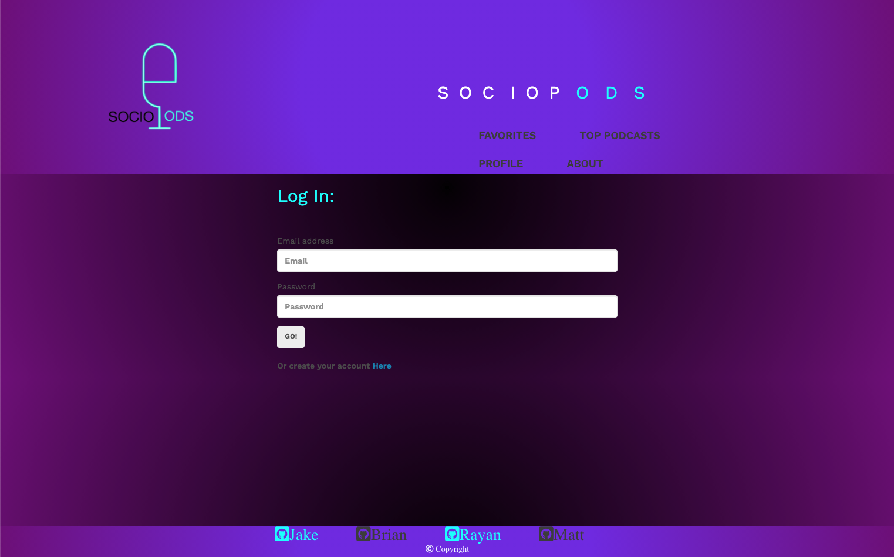

# SocioPod
      
    

## Description
This Application will allow the user to create an account in which they can fill out their interests and be shown podcasts that match their fit. When the user fills out the questionnaire, an API call will present the user's podcast that they would like. The user sees the Podcast name and episode and links to listen to it on streaming platforms. The user's data, such as their interests and favorites, will be stored in a SQL database. This Application is powered by HTML5, CSS, Javascript, Node.js, MySQL, and is Deployed on Heroku.



## Table of Contents
* [Installation](#installation)
* [Usage](#usage)
* [License](#license)
* [Contribution Guidelines](#contribution-guidelines)
* [Tests](#tests)
* [Questions](#questions)
## Installation
To install run the following command:
``` npm i ```
## Use
User who wants to see Podcastes based of the intrestes they choose 
## License
This project is licensed under MIT license.
## Contribution 
Rayan Ahmedy, Matthew Stalzer, Jake Battaglia and Brian Abedi
## Tests
Run the following command:
``` npm test ```


## Contact 
ahmedyrayan2020@gmail.com , mjstalzer@gmail.com , Jbaked12@gmail.com , 
##
